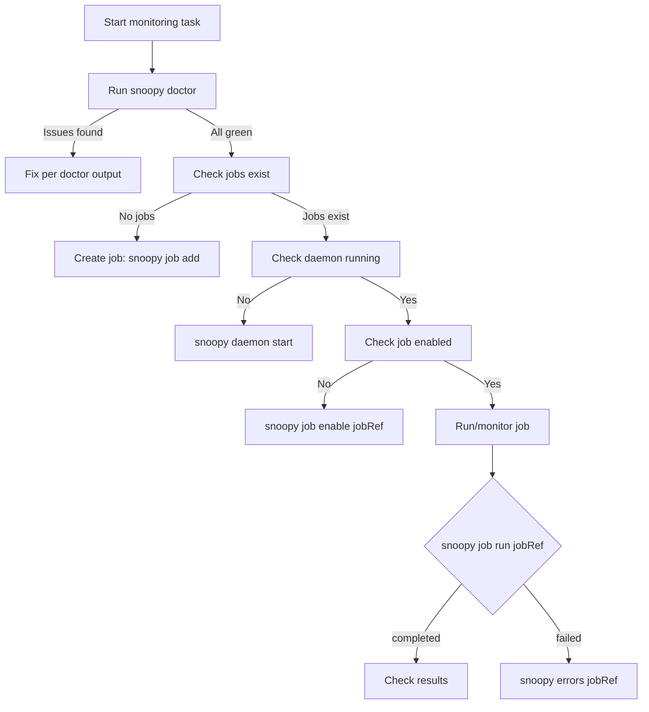

# For Agents

This section is written for AI agents, LLMs, and automation systems operating Snoopy programmatically. If you are a human developer, start with the [Quickstart](../getting-started/quickstart.md).

## Scope

This section covers:

- How to verify Snoopy's health before acting
- Which sources are canonical
- What constraints apply during automation
- How to handle failures deterministically
- How to use the MCP server for programmatic access
- How to register Snoopy with agent frameworks
- How to use Snoopy skill packages

For the end-to-end monitoring runbook, see the [Agent Operations Guide](../guides/agent-operations.md).

## Canonical sources

| Topic | Source |
|---|---|
| CLI commands | `src/cli/index.ts`, `src/cli/commands/*.ts` |
| DB schema | `src/services/db/migrations/`, `docs/reference/database-schema.md` |
| Job types | `src/types/job.ts` |
| Settings types | `src/types/settings.ts` |
| MCP tools | `src/mcp/tools.ts`, `src/mcp/server.ts` |
| Agent install | `src/agent/install.ts` |

Documentation canonical URLs:

- CLI reference: `/reference/cli-reference`
- Database schema: `/reference/database-schema`
- Agent operations: `/guides/agent-operations`

## Decision flow



## Constraints

The following behaviors are invariants; do not attempt to work around them:

- **Always require an OpenRouter API key.** Without it, qualification runs will fail. Use `snoopy doctor` to verify.
- **Daemon must be running for scheduled jobs.** `snoopy daemon start` is required before jobs run on schedule.
- **Run logs auto-delete after 5 days.** Export results if you need longer retention.
- **One active run per job.** A job cannot have two concurrent runs. Wait for the current run to finish.
- **Job references accept ID or slug.** Use whichever is available; both work everywhere.

## Command health check

Before any monitoring task, verify the system is healthy:

```bash
snoopy doctor
```

A successful response confirms: database is reachable, API key is configured, daemon status is known, and recent errors are reported. If this fails, follow the [decision flow](#decision-flow) above.

## Failure handling

| Error | Recommended action |
|---|---|
| API key missing | Run `snoopy settings` or set `TELEPAT_OPENROUTER_KEY` |
| Daemon not running | Run `snoopy daemon start` |
| Job run failed | Run `snoopy errors <jobRef>` and `snoopy logs <runId>` |
| Active run conflict | Wait for current run to finish or check `snoopy job runs <jobRef>` |
| Token truncation | Increase `maxTokens` via `snoopy settings` |
| DB locked | Retry after a moment; another process may be writing |

For all failures: run `snoopy doctor` first for a system health overview.

## Machine-readable output

All Snoopy CLI commands that support `--json` emit deterministic, structured output. Use `--json` for all automation workflows:

```bash
snoopy export <jobRef> --json --last-run
snoopy consume <jobRef> --json
snoopy consume <jobRef> --json --dry-run
```

MCP tools all return structured JSON automatically.

## Related pages

- [MCP Server](./mcp-server.md) — MCP server documentation and tool list.
- [Agent Setup](./agent-setup.md) — register Snoopy with agent frameworks.
- [Skills](./skills.md) — Snoopy skill packages for agent workflows.
- [Agent Operations Guide](../guides/agent-operations.md) — end-to-end runbook with DB access patterns.
- [Database Schema](../reference/database-schema.md) — full table schema for direct DB access.
