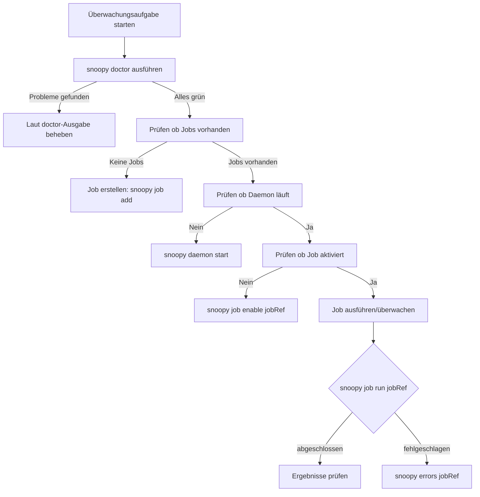

# Für Agenten

Dieser Abschnitt ist für KI-Agenten, LLMs und Automatisierungssysteme geschrieben, die Snoopy programmgesteuert betreiben. Wenn Sie ein menschlicher Entwickler sind, beginnen Sie mit dem [Schnellstart](../getting-started/quickstart.md).

## Umfang

Dieser Abschnitt behandelt:

- Wie Sie Snoopy's Gesundheit überprüfen, bevor Sie handeln
- Welche Quellen kanonisch sind
- Welche Einschränkungen bei der Automatisierung gelten
- Wie Sie Fehler deterministisch behandeln
- Wie Sie den MCP-Server für programmgesteuerten Zugriff verwenden
- Wie Sie Snoopy bei Agenten-Frameworks registrieren
- Wie Sie Snoopy-Skill-Pakete verwenden

Für das End-to-End-Überwachungs-Runbook siehe die [Agenten-Operations-Anleitung](../guides/agent-operations.md).

## Kanonische Quellen

| Thema | Quelle |
|---|---|
| CLI-Befehle | `src/cli/index.ts`, `src/cli/commands/*.ts` |
| DB-Schema | `src/services/db/migrations/`, `docs/reference/database-schema.md` |
| Job-Typen | `src/types/job.ts` |
| Einstellungstypen | `src/types/settings.ts` |
| MCP-Tools | `src/mcp/tools.ts`, `src/mcp/server.ts` |
| Agenten-Installation | `src/agent/install.ts` |

Dokumentation kanonische URLs:

- CLI-Referenz: `/reference/cli-reference`
- Datenbankschema: `/reference/database-schema`
- Agenten-Operationen: `/guides/agent-operations`

## Entscheidungsablauf



## Einschränkungen

Die folgenden Verhaltensweisen sind Invarianten; versuchen Sie nicht, sie zu umgehen:

- **Immer einen OpenRouter-API-Schlüssel erfordern.** Ohne ihn werden Qualifizierungsläufe fehlschlagen. Verwenden Sie `snoopy doctor` zur Überprüfung.
- **Daemon muss für geplante Jobs laufen.** `snoopy daemon start` ist erforderlich, bevor Jobs nach Zeitplan laufen.
- **Laufprotokolle werden nach 5 Tagen automatisch gelöscht.** Exportieren Sie Ergebnisse, wenn Sie eine längere Aufbewahrung benötigen.
- **Ein aktiver Lauf pro Job.** Ein Job kann nicht zwei gleichzeitige Läufe haben. Warten Sie, bis der aktuelle Lauf abgeschlossen ist.
- **Job-Referenzen akzeptieren ID oder Slug.** Verwenden Sie, was verfügbar ist; beides funktioniert überall.

## Befehls-Gesundheitsprüfung

Vor jeder Überwachungsaufgabe überprüfen Sie, ob das System gesund ist:

```bash
snoopy doctor
```

Eine erfolgreiche Antwort bestätigt: Datenbank ist erreichbar, API-Schlüssel ist konfiguriert, Daemon-Status ist bekannt und kürzliche Fehler werden gemeldet. Wenn dies fehlschlägt, folgen Sie dem [Entscheidungsablauf](#entscheidungsablauf) oben.

## Fehlerbehandlung

| Fehler | Empfohlene Maßnahme |
|---|---|
| API-Schlüssel fehlt | `snoopy settings` ausführen oder `TELEPAT_OPENROUTER_KEY` setzen |
| Daemon läuft nicht | `snoopy daemon start` ausführen |
| Job-Lauf fehlgeschlagen | `snoopy errors <jobRef>` und `snoopy logs <runId>` ausführen |
| Aktiver Laufkonflikt | Warten Sie, bis der aktuelle Lauf abgeschlossen ist, oder überprüfen Sie `snoopy job runs <jobRef>` |
| Token-Abbruch | Erhöhen Sie `maxTokens` über `snoopy settings` |
| DB gesperrt | Nach einer Weile erneut versuchen; ein anderer Prozess schreibt möglicherweise |

Für alle Fehler: Führen Sie zuerst `snoopy doctor` für einen Systemgesundheitsüberblick aus.

## Maschinenlesbare Ausgabe

Alle Snoopy-CLI-Befehle, die `--json` unterstützen, geben deterministische, strukturierte Ausgabe aus. Verwenden Sie `--json` für alle Automatisierungsworkflows:

```bash
snoopy export <jobRef> --json --last-run
snoopy consume <jobRef> --json
snoopy consume <jobRef> --json --dry-run
```

MCP-Tools geben alle automatisch strukturiertes JSON zurück.

## Verwandte Seiten

- [MCP-Server](./mcp-server.md) — MCP-Server-Dokumentation und Tool-Liste.
- [Agenten-Einrichtung](./agent-setup.md) — Snoopy bei Agenten-Frameworks registrieren.
- [Skills](./skills.md) — Snoopy-Skill-Pakete für Agenten-Workflows.
- [Agenten-Operations-Anleitung](../guides/agent-operations.md) — End-to-End-Runbook mit DB-Zugriffsmustern.
- [Datenbankschema](../reference/database-schema.md) — Vollständiges Tabellenschema für direkten DB-Zugriff.
