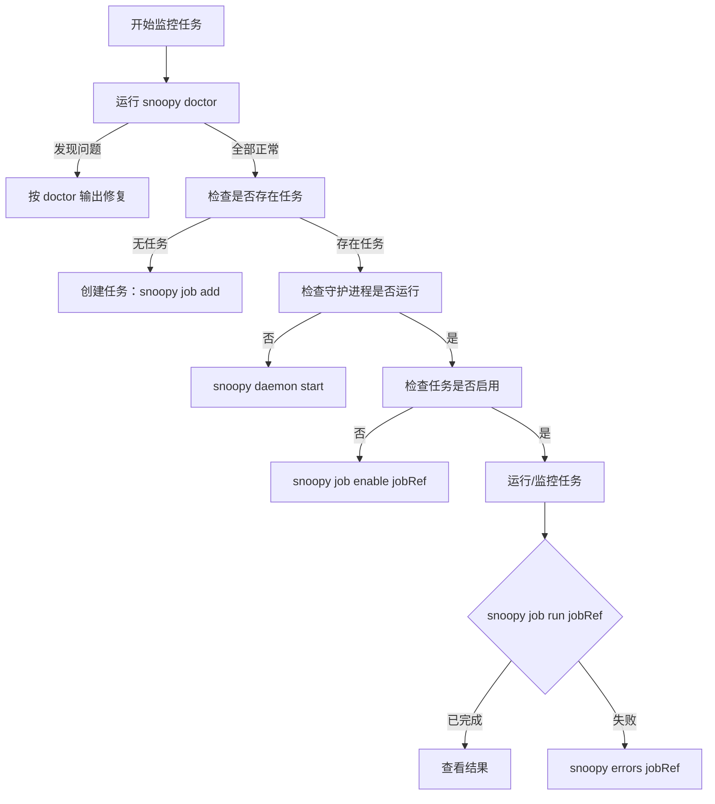

# 面向智能体

本章节面向以编程方式操作 Snoopy 的 AI 智能体、LLM 和自动化系统。如果您是人类开发者，请从[快速入门](../getting-started/quickstart.md)开始。

## 范围

本章节涵盖：

- 如何在执行操作前验证 Snoopy 的健康状态
- 哪些来源是规范来源
- 自动化过程中适用哪些约束
- 如何确定性地处理故障
- 如何使用 MCP 服务器进行编程式访问
- 如何在智能体框架中注册 Snoopy
- 如何使用 Snoopy 技能包

端到端监控操作手册请参阅[智能体运维指南](../guides/agent-operations.md)。

## 规范来源

| 主题 | 来源 |
|---|---|
| CLI 命令 | `src/cli/index.ts`、`src/cli/commands/*.ts` |
| 数据库架构 | `src/services/db/migrations/`、`docs/reference/database-schema.md` |
| 任务类型 | `src/types/job.ts` |
| 设置类型 | `src/types/settings.ts` |
| MCP 工具 | `src/mcp/tools.ts`、`src/mcp/server.ts` |
| 智能体安装 | `src/agent/install.ts` |

文档规范 URL：

- CLI 参考：`/reference/cli-reference`
- 数据库架构：`/reference/database-schema`
- 智能体运维：`/guides/agent-operations`

## 决策流程



## 约束条件

以下行为是不可变约束，请勿试图绕过：

- **始终需要 OpenRouter API 密钥。** 缺少密钥，资格鉴定运行将失败。使用 `snoopy doctor` 进行验证。
- **守护进程必须在运行才能执行计划任务。** 任务按计划执行前必须先执行 `snoopy daemon start`。
- **运行日志在 5 天后自动删除。** 如需更长的保留时间，请导出结果。
- **每个任务最多一个活动运行。** 一个任务不能有两个并发运行。请等待当前运行完成。
- **任务引用支持 ID 或 slug。** 使用任意格式均可，两者在所有地方都通用。

## 命令健康检查

在执行任何监控任务之前，请验证系统是否健康：

```bash
snoopy doctor
```

成功响应将确认：数据库可访问、API 密钥已配置、守护进程状态已知、最近错误已报告。如果此命令失败，请遵循上方的[决策流程](#决策流程)。

## 故障处理

| 错误 | 建议操作 |
|---|---|
| API 密钥缺失 | 运行 `snoopy settings` 或设置 `TELEPAT_OPENROUTER_KEY` |
| 守护进程未运行 | 运行 `snoopy daemon start` |
| 任务运行失败 | 运行 `snoopy errors <jobRef>` 和 `snoopy logs <runId>` |
| 活动运行冲突 | 等待当前运行完成或检查 `snoopy job runs <jobRef>` |
| Token 截断 | 通过 `snoopy settings` 增加 `maxTokens` |
| 数据库锁定 | 稍后重试；可能其他进程正在写入 |

所有故障：首先运行 `snoopy doctor` 获取系统健康概览。

## 机器可读输出

所有支持 `--json` 的 Snoopy CLI 命令都会输出确定性、结构化的结果。在所有自动化工作流中使用 `--json`：

```bash
snoopy export <jobRef> --json --last-run
snoopy consume <jobRef> --json
snoopy consume <jobRef> --json --dry-run
```

MCP 工具全部自动返回结构化 JSON。

## 相关页面

- [MCP 服务器](./mcp-server.md) — MCP 服务器文档和工具列表。
- [智能体设置](./agent-setup.md) — 在智能体框架中注册 Snoopy。
- [技能](./skills.md) — 面向智能体工作流的 Snoopy 技能包。
- [智能体运维指南](../guides/agent-operations.md) — 端到端操作手册，含数据库访问模式。
- [数据库架构](../reference/database-schema.md) — 完整的数据库表结构，用于直接访问数据库。
